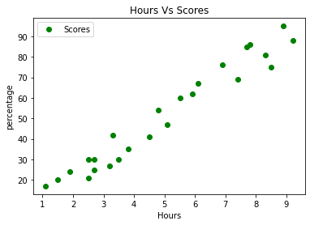
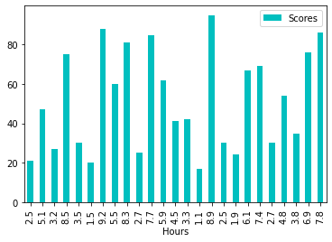
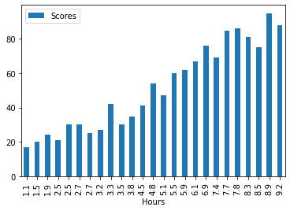

```python
#importing Required libraries
import pandas as pd
import numpy as p
import seaborn as sns
import matplotlib.pyplot as plt
%matplotlib Inline
```


```python
#Importing Data
data = pd.read_csv("student_scores - student_scores.csv")
```


```python
#First Five records
data.head()
```


<div>
<style scoped>
    .dataframe tbody tr th:only-of-type {
        vertical-align: middle;
    }

    .dataframe tbody tr th {
        vertical-align: top;
    }

    .dataframe thead th {
        text-align: right;
    }
</style>
<table border="1" class="dataframe">
  <thead>
    <tr style="text-align: right;">
      <th></th>
      <th>Hours</th>
      <th>Scores</th>
    </tr>
  </thead>
  <tbody>
    <tr>
      <th>0</th>
      <td>2.5</td>
      <td>21</td>
    </tr>
    <tr>
      <th>1</th>
      <td>5.1</td>
      <td>47</td>
    </tr>
    <tr>
      <th>2</th>
      <td>3.2</td>
      <td>27</td>
    </tr>
    <tr>
      <th>3</th>
      <td>8.5</td>
      <td>75</td>
    </tr>
    <tr>
      <th>4</th>
      <td>3.5</td>
      <td>30</td>
    </tr>
  </tbody>
</table>
</div>


```python
#total number of row and coloum
data.shape
```


    (25, 2)


```python
data.describe()
```


<div>
<style scoped>
    .dataframe tbody tr th:only-of-type {
        vertical-align: middle;
    }

    .dataframe tbody tr th {
        vertical-align: top;
    }

    .dataframe thead th {
        text-align: right;
    }
</style>
<table border="1" class="dataframe">
  <thead>
    <tr style="text-align: right;">
      <th></th>
      <th>Hours</th>
      <th>Scores</th>
    </tr>
  </thead>
  <tbody>
    <tr>
      <th>count</th>
      <td>25.000000</td>
      <td>25.000000</td>
    </tr>
    <tr>
      <th>mean</th>
      <td>5.012000</td>
      <td>51.480000</td>
    </tr>
    <tr>
      <th>std</th>
      <td>2.525094</td>
      <td>25.286887</td>
    </tr>
    <tr>
      <th>min</th>
      <td>1.100000</td>
      <td>17.000000</td>
    </tr>
    <tr>
      <th>25%</th>
      <td>2.700000</td>
      <td>30.000000</td>
    </tr>
    <tr>
      <th>50%</th>
      <td>4.800000</td>
      <td>47.000000</td>
    </tr>
    <tr>
      <th>75%</th>
      <td>7.400000</td>
      <td>75.000000</td>
    </tr>
    <tr>
      <th>max</th>
      <td>9.200000</td>
      <td>95.000000</td>
    </tr>
  </tbody>
</table>
</div>


```python
#no null values in Dataset
data.isnull().any()
```


    Hours     False
    Scores    False
    dtype: bool


```python
data.plot(x="Hours", y="Scores",color='g',style= 'o')

plt.title("Hours Vs Scores")
plt.xlabel("Hours")
plt.ylabel("percentage")
plt.show()
```


    

    


```python
data.plot.bar(x="Hours", y="Scores", color='c',style= 'o')
```


    <AxesSubplot:xlabel='Hours'>


    

    


```python
data.sort_values(["Hours"],axis=0, ascending=[True],inplace=True)
data.plot.bar(x="Hours", y ="Scores")
```


    <AxesSubplot:xlabel='Hours'>


    

    


Observations from above graphs-

As study hours increases scores also increases


```python
#dividing the data
X = data.iloc[:, :-1].values
y = data.iloc[:, 1].values
```


```python
from sklearn.model_selection import train_test_split
```


```python
#spliting thee data
X_train, X_test, y_train, y_test = train_test_split(X, y, test_size=0.2, random_state=0)
```


```python
#algorithm
from sklearn.linear_model import LinearRegression
regressor = LinearRegression()
regressor.fit(X_train, y_train)
```


    LinearRegression()


```python
#regression line
line = regressor.coef_*x+regressor.intercept_

#Plotting for the test
plt.scatter(X, y,color="c")
plt.plot(X, line);
plt.show()
```


    

    


# Ready for Testing


```python
print("ORIGINAL SCORES")
print(y_test)
print("PREDICTED SCORES")
y_pred = regressor.predict(X_test)
print(y_pred)
```

    ORIGINAL SCORES
    [30 24 85 67 41]
    PREDICTED SCORES
    [28.6177145  20.88803334 76.92822173 61.46885942 46.0094971 ]
    


```python
datanew = pd.DataFrame({"Actual":y_test, "Predicted":y_pred})
datanew
```


<div>
<style scoped>
    .dataframe tbody tr th:only-of-type {
        vertical-align: middle;
    }

    .dataframe tbody tr th {
        vertical-align: top;
    }

    .dataframe thead th {
        text-align: right;
    }
</style>
<table border="1" class="dataframe">
  <thead>
    <tr style="text-align: right;">
      <th></th>
      <th>Actual</th>
      <th>Predicted</th>
    </tr>
  </thead>
  <tbody>
    <tr>
      <th>0</th>
      <td>30</td>
      <td>28.617714</td>
    </tr>
    <tr>
      <th>1</th>
      <td>24</td>
      <td>20.888033</td>
    </tr>
    <tr>
      <th>2</th>
      <td>85</td>
      <td>76.928222</td>
    </tr>
    <tr>
      <th>3</th>
      <td>67</td>
      <td>61.468859</td>
    </tr>
    <tr>
      <th>4</th>
      <td>41</td>
      <td>46.009497</td>
    </tr>
  </tbody>
</table>
</div>


What will be the predicted score if a student studies for 9.25 hrs/day?


```python
hours = [[9.25]]
prediction = regressor.predict(hours)

print(prediction)
```

    [91.90447898]
    

so the predicted score for 9.25 hours of study per day is 91.9


```python
from sklearn import metrics
print('Mean absolute error = ',metrics.mean_absolute_error(y_test,  y_pred))
```

    Mean absolute error =  4.183859899002975
    


```python
#checking the model

from sklearn.metrics import r2_score
print("R2 Score = ", r2_score(y_test, y_pred))
```

    R2 Score =  0.9454906892105356
    


```python

```
